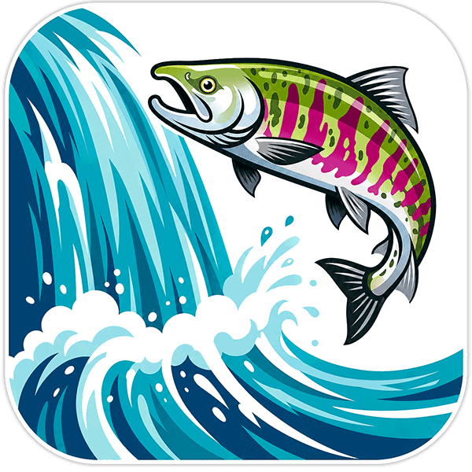

# chum - Context Hierarchy Using Markdown

<p align="center">
  
</p>

`chum` is an installable agent skill for maintaining filesystem-first
repository documentation.

It turns the workflow described in `AGENTS.template.md` into a skill plus a
deterministic Python processor:

```bash
uv run scripts/chum.py targets --root . --json
uv run scripts/chum.py normalize --root . --target src/foo.py --stdin --write
uv run scripts/chum.py validate --root . --target src/foo.py --json
uv run scripts/chum.py check --root . --json
uv run scripts/chum.py archive --root . <change-id> --write --json
```

The script does not call an LLM. The active agent session keeps shared codebase
context, plans its own route through related files and directories, writes
current-state specs, and uses `scripts/chum.py` for discovery, validation,
normalization, init, and archive mechanics.

## Install

This repository root is the skill folder. Install it as a Codex skill from the
repo root path; `SKILL.md` is intentionally at the top level.

The publishable skill surface is:

- `SKILL.md`
- `agents/openai.yaml`
- `scripts/chum.py`
- `references/`

The remaining files are project docs, tests, specs, and current design/plan
context for maintaining this repo.

## Skill Usage

Start with [SKILL.md](./SKILL.md). The usual loop is:

1. Run `targets --json`.
2. Read existing specs and related source files.
3. Update specs with accumulated repo context.
4. Run `normalize` and `validate` for focused targets.
5. Finish with `check --json`.

Use `python3 scripts/chum.py ...` as a local development fallback when `uv` is
not installed.
In restricted sandboxes where `uv` cannot write its default cache, set
`UV_CACHE_DIR=/tmp/chum-uv-cache`.

When the skill is installed outside the target repo, resolve the script path
from the installed skill directory and pass the repository to inspect via
`--root`:

```bash
uv run /path/to/chum/scripts/chum.py targets --root /path/to/repo --json
```

## Development

```bash
python3 scripts/chum.py --help
python3 -m unittest discover tests
UV_CACHE_DIR=/tmp/chum-uv-cache uv run scripts/chum.py --help
python3 scripts/chum.py check --root . --json
```

## Status

The current implementation follows `plan/skill/`.
